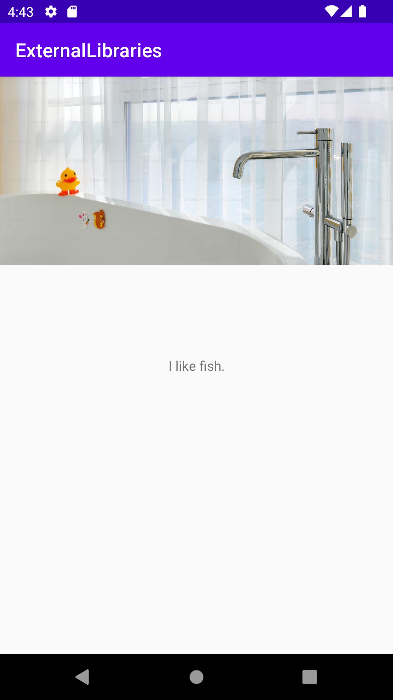

# Rapport

**Assignment 8 (VG): External Libraries**

For this assignment, the goal is to use an external library,
that is pre-written code which one can make use of to implement in their project.
Of course, this comes with a risk: Research has to be made and critical thinking has to take place,
to make sure that the code is safe to use.

Therefor, for this project the external library Picasso has been chosen.
The reason for using specifically Picasso can be boiled down to these:
- It is easy to use
- It is well-known and widely used in both examples and recommendations
- It is created and maintained by Square, which is also a well known company, built on open source.

To use Picasso, probably the easiest way is to add it as a dependency in the gradle using the code below:
```
dependencies {
...
implementation 'com.squareup.picasso:picasso:(version)'
}
```

Where (version) is switched with the number of the version one would like to use.
In this project, the version 2.8 is used.

To use Picasso, an imageview is needed to load an image into and displayed through.
This is done using the following code:
```
ImageView imageView = findViewById(R.id.my_image);
```

Where **my_image** is the id for the image view in the xml file for the activity.
To illustrate how Picasso works, an image is chosen from the website unsplash.com as they have quite the collection of photos that are free to use.

From their own website:

"The photos on Unsplash are free to use and can be used for most commercial,
personal projects, and for editorial use.
You do not need to ask permission from or provide credit to the photographer or Unsplash,
although it is appreciated when possible."

The URL for the image is then put in a String, then the string is used as an argument in the code for Picasso.
See code:
```
Picasso.get()
    .load(imageURL)
    .placeholder(R.drawable.buffering)
    .into(imageView);
```

Where *imageURL* is the String with the URL for the image,
*buffering* is a vector file in drawable folder, it comes with Android Studio,
*imageView* is the variable name given to a declared ImageView.

The result is the following:


The text with "I like fish." is not part of Picasso's functionality, I just thought it was funny.
